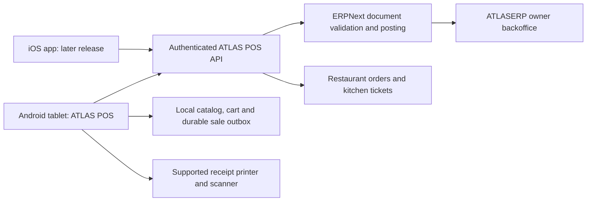

# ATLAS POS — Android tablet first

Prepared 2026-10-06. This is a product and implementation plan, not a released
mobile application. Android tablets are the first delivery target; iPad/iPhone
follow after the Android restaurant workflow is proven. The user confirmed that
**offline cash sales are essential** and selected **Epson** for printing. The
tablet below is our recommended pilot device; the exact existing Epson model,
purchase availability and physical compatibility checks remain to be confirmed.

## Product direction

Build a dedicated ATLAS POS application with the ATLASERP green/lime design.
ERPNext remains responsible for submitted invoices, stock and accounting;
ATLASERP supplies the restaurant workflows, device APIs and owner backoffice.
Use Street Pizza (Demo) as a development dataset, not evidence of a commercial
partnership or a fiscally approved restaurant setup.

The competitive goal is a complete, dependable business system: fast checkout,
clear cashier setup, restaurant service, receipts, stock and owner visibility.
Success must be measured through real cashier tasks and reconciled transactions,
not the number of settings or menu entries.

## Public LaCaisse benchmark

Reviewed on 2026-10-06. Its public documentation lists catalog, privileges,
customers, loyalty, discounts, reporting, payments, stock, invoicing, online
orders and restaurant operations. Its Android app listing specifically describes
table order taking and a second checkout station. These are public feature
references; main-register Android support, offline behavior and exact hardware
compatibility have not been verified here.

- [LaCaisse documentation](https://documentation.lacaisse.ma/)
- [LaCaisse public site](https://caisse.ma/fr/homepage)
- [LaCaisse Android listing](https://play.google.com/store/apps/details?id=com.lacaisse.app&hl=en_US)

The following architecture and delivery order are our proposed ATLAS design.

## Architecture decision

Recommend **Flutter** for a shared Android/iOS interface and application logic,
with native Kotlin/Swift adapters where hardware requires a vendor SDK. Validate
this choice on the actual tablet and printer before committing to those devices.
An embedded ERP web page alone will not supply the required local storage,
hardware behavior or restaurant workflows.

| Component | Responsibility |
| --- | --- |
| Planned `mobile/atlas_pos/` | Flutter screens, application state, API client, local database, hardware adapters |
| Planned `apps/atlas_erp/atlas_erp/pos_api/` | Versioned POS operations, authorization, request deduplication and register context |
| Existing ERPNext | Financial and stock document lifecycle; no direct ledger writes from the app |
| Restaurant extension | Unpaid orders, tables, modifiers, kitchen tickets and settlement links |
| Existing ATLASERP web backoffice | Company/brand/branch, products, prices, purchasing and management workflows |

Use authenticated HTTPS requests. Evaluate OAuth authorization code with PKCE
against the pinned Frappe version before adopting it; native-client support and
revocation need an integration test. Store device tokens in OS protected storage.
Do not embed an Administrator key, store the user's password, or treat a short
cashier PIN as sufficient server authentication. A PIN may unlock an already
authorized local cashier session under a reviewed policy.

One business customer normally receives its own Frappe site/database. Brand,
branch and register are operational scopes inside that customer. Company records
alone are not tenant isolation. Device enrollment and every server operation must
enforce the allowed site, company, branch, register and actual cashier identity.
Audit generic ERP APIs and existing whitelisted POS helpers as well as new APIs.

## Delivery phases

| Phase | Delivered behavior | Exit evidence |
| --- | --- | --- |
| 0 — Register readiness | Company, cashier assignment, price list, warehouse and payment mappings checked before opening; resume own shift or explain another cashier's open shift | A restricted cashier opens the correct register without developer help; wrong scope and concurrent opening are rejected |
| 1 — Android counter POS | Sign-in/enrollment, menu/categories/search, cart, validated modifiers, cash payment/change, receipt, return and cash closing | Open → sell → print → return → close reconciles with ERPNext on the selected tablet/printer |
| 2 — Offline cash | Cached approved catalog, durable local cash sales, recovery and visible synchronization queue | Network loss, app restart, server timeout and repeated replay lose no sales and create no duplicate invoice |
| 3 — Restaurant service | Tables, takeaway/delivery orders, waiter orders, kitchen routing/display, statuses, table transfer and split settlement | Concurrent waiter edits, kitchen retries and settlement retries preserve orders and produce the correct invoice(s) |
| 4 — Owner operations | Brands/branches, ingredient recipes and wastage, buying, counts, transfers, staff controls, reports, loyalty and promotions | Branch reports match posted records; ingredients and purchasing reconcile; operator permissions tested through APIs |
| 5 — Customer channels and payments | QR menu/order flow, delivery dispatch, online storefront and country/provider payment integrations | Orders reach the right branch; payment callbacks are authenticated, deduplicated and reconciled |
| 6 — iOS and expansion | iPad POS, iPhone waiter/owner layouts, onboarding/billing/support and country packs | Real iOS hardware checks and store release requirements pass; each country pack has its own pilot and local review |

An online development build may precede phase 2. **Phase 2 is mandatory before
the first commercial pilot**, following the user's offline cash requirement.
Phase 1 includes basic meal modifiers; full table/kitchen operations follow in
phase 3. Card/transfer recording and actual electronic payment processing are
separate capabilities.

## Small tasks, in order

| ID | Bounded task | Acceptance |
| --- | --- | --- |
| MOB-01 | Specify register readiness and action permissions | Missing cashier/account/profile and existing-shift cases have actionable owner/cashier messages; no automatic cancellations |
| MOB-02 | Install/pin Flutter toolchain and create Android app | Debug APK installs on a named device; green/lime tablet layout, French foundation and Arabic RTL direction verified |
| MOB-03 | Device enrollment and cashier authentication | Tokens protected/revocable; restricted user cannot access another site/branch; Administrator credentials not used at the till |
| MOB-04 | Scoped bootstrap API and catalog cache | Correct brand/branch/register, 63 demo menu prices and required meal choices load; setup blockers identified before checkout |
| MOB-05 | Session resume/open flow | Own session resumes; another cashier's session explains the block; one profile per register; duplicate opening requests return the same result |
| MOB-06 | Touch catalog, search and cart | Large touch targets, quantities and required modifier limits; interrupted cart survives restart; scanner focus demonstrated |
| MOB-07 | Server quotation and idempotent cash sale | Server validates prices/taxes/discount authority; double tap, timeout and retry produce one submitted invoice with correct change |
| MOB-08 | Hardware receipt adapter | Correct totals and sale identity print on the agreed printer; failure does not repost a sale; uncertain delivery/reprints are explicit |
| MOB-09 | Return and closing | Authorized original-sale refunds and counted cash variance reconcile; no silent cancellation of another cashier's shift |
| MOB-10 | Offline outbox and synchronization | Local sale plus outbox written atomically; duplicate replay, crash recovery, stale catalog and rejected records tested |
| MOB-11 | Android pilot hardening | Real-device lifecycle, backup/restore, tenant isolation, app upgrade and support diagnostics pass |
| REST-01 onward | Unpaid table orders → kitchen → shared settlement | Continue the small tasks in POS_WORKFLOW.md, then add transfer/split-bill cases |

The immediate next implementation slice is **MOB-01/MOB-02**, then authenticated
catalog loading. Do not describe a cart mockup or unconnected APK as a working POS.

## Prevent the setup failures already observed

The opening screen must show a human-readable restaurant/branch/register name,
not require cashiers to understand payment ledgers or configure POS Profiles.

- Only offer profiles assigned to the authenticated cashier and allowed branch.
- Select a permitted register's company explicitly; never retain another company
  from global defaults while using that profile's payments or menu.
- Before opening, validate every configured payment method's company account.
  Owners get links to the missing setup; cashiers see who can resolve it.
- Resume the current cashier's open session. For another cashier's open session,
  show the register and cashier with a manager handover/closing route. Cancel an
  unused opening only through an explicit authorized operation.
- Each simultaneous physical till gets its own POS Profile. Multiple assigned
  users do not make one profile support multiple simultaneous open shifts.
- Cash, card, transfer and cheque mappings are deliberately configured. Never
  hide an account error by mapping another company's money to the demo cash till.

## Offline correctness

SQLite is the proposed local store. A completed local cash sale and its outgoing
event must be durable in one transaction before showing local success. Each sale
has a device-generated request identity, catalog/tax policy version, cashier,
register, session and business event timestamp. Amounts use currency minor units
or decimal values, not binary floating-point cart arithmetic.

Delivery is retryable; a server-side unique request identity and transactional
posting prevent duplicate invoices. The server verifies permissions and uses
ERPNext's normal document operations. A repeated request returns its original
result. Sync states are visible: pending, syncing, synchronized and needs review.
A rejected event is retained with its cash/receipt evidence; it is never silently
discarded or repriced after the customer has paid.

Agree policies for stale prices/taxes, stock overselling, expired authorization,
closed accounting periods and server-side session changes before permitting
offline selling. Offline authorization is bounded to an enrolled device/cashier
and an established register/session; it does not allow arbitrary new users or
companies. Final closing waits for reconciliation of pending sales.

Offline receipt numbering and its relationship to final fiscal invoices need
local accountant review. An unsynchronized local sale must remain distinguishable
from a server-posted invoice. Offline cash acceptance does not prove offline card
or mobile-money processing: those depend on the provider and certified terminal.

Initial offline support is for one till and its local printing. Multi-tablet
waiter/kitchen collaboration during an internet outage needs a separately tested
local-network authority or shop hub; isolated tablets cannot promise coherent
shared table orders. Do not present those two offline capabilities as equivalent.

## Restaurant and hardware requirements

Plan menu sizes/variants, extras, required combo choices, notes/allergens,
available/sold-out state, table ownership, additions sent as new kitchen tickets,
prep/ready/served statuses, bill preview, transfer and split-by-item/amount.
Unpaid orders do not submit accounting sales. Settlement links paid orders to
validated invoices, and repeated kitchen sends/settlement cannot duplicate them.

Record exact tablet/terminal and printer models, Android version, paper width,
USB/Bluetooth/LAN connection, scanner input, cash drawer and customer display.
Use vendor SDKs where needed. A cash drawer connected through a printer is a
different integration from a standalone USB device. Arabic receipt rendering and
French accents must be tested on paper; UI RTL alone does not establish support.
iOS printer transport/SDK compatibility needs its own check.

Print jobs have their own retry history. A lost printer acknowledgement can mean
the receipt already printed; display that uncertainty and label reprints rather
than guaranteeing one physical print. Tablet sleep/restart, cable loss, printer
paper-out and app updates must be part of hardware testing.

### Recommended premium pilot kit

This recommendation prioritizes daily restaurant use and support life. It is a
candidate for our first supported configuration, not an already certified pair.

| Part | Proposed choice | Reason and purchase check |
| --- | --- | --- |
| Android tablet | Samsung Galaxy Tab Active5 Pro, 10.1-inch; Moroccan 6 GB / 128 GB model SM-X356BZGAMWD | IP68, replaceable batteries and security support listed through 31 May 2033; get a local warranty/service quote |
| Receipt printer | Epson TM-m30III, 80 mm paper, Ethernet-equipped regional SKU | Local network printing and drawer connector; confirm exact model/interfaces and included power supply |
| Counter mount and power | Secure tablet stand, dedicated Samsung-compatible charger or approved dock | Validate continuous charging, thermal behavior and secure cable routing |
| Shop network | Local Wi-Fi access point/router plus Ethernet to the printer | Keep tablet and printer reachable without the internet; turn off client isolation on the intended POS network and reserve the printer address |
| Cash drawer | Drawer explicitly compatible with the printer's kick connector | Check electrical requirements and connector; a matching-looking plug alone is insufficient |

Manufacturer references: [Samsung Morocco tablet specifications](https://www.samsung.com/n_africa/business/tablets/galaxy-tab-active/galaxy-tab-active5-pro-sm-x356bzgamwd/),
[Epson printer specifications](https://download4.epson.biz/sec_pubs/bs/html/m001464/en/chap07_1.html)
and [Epson connectors](https://download4.epson.biz/sec_pubs/bs/html/m001464/en/chap02_3.html).
Prices, local stock and warranty terms have not been verified; request a Moroccan
supplier quote before purchasing. Buy/test one pilot kit before ordering a fleet.

Use the Epson ePOS SDK through a native Android adapter and keep Flutter receipt
formatting separate from transport. Pin a tested SDK/firmware combination after
model confirmation. [Epson's TM-m30III software list](https://support.epson.net/setupnavi/index.php?LG2=EN&MKN=TM-m30III&OSC=ARD&PINF=swlist)
lists the Android SDK; [Epson's SDK documentation](https://download4.epson.biz/sec_pubs/pos/reference_en/technology/epson_epos_sdk.html)
describes Android/iOS interfaces and model-dependent transports.

Use separate tablet power for this kit. Epson lists printer USB-PD output up to
18 W (9 V / 2 A); Samsung specifies at least 9 V / 2.3 A with PD 2.0 for its
No Battery Mode. Their specifications do not establish adequate printer power
for that mode. This is an inference from the linked specifications, not a
physical compatibility result. Normal battery operation and charging still need
testing. No Battery Mode also has performance/display limits.

An internet outage and a power outage are separate cases. Local cash checkout and
LAN printing must work with the WAN disconnected while local equipment is powered.
If the shop requires printing during a power cut, size and test a UPS for the
printer and network; running the tablet on its battery alone cannot power them.
No Battery Mode depends on continuous external power.

Hardware acceptance on the named kit: all-day charging/temperature test; WAN
unplugged receipt; French accents/Arabic rendering on paper; paper-out/recovery;
tablet restart with a pending sale; lost printer acknowledgement; drawer action;
and restoration of synchronization without a second invoice. A kitchen printer
is a separate later selection based on heat, grease and ticket-routing needs.

## Morocco and African market packs

Start with MAD, French and Arabic, familiar receipt terminology, clear cashier
training and owner reporting. Validate identity fields, tax configurations,
invoice/credit/receipt requirements and numbering with a Moroccan accountant for
the actual business regime. The demo is not a compliance certification.

Expand by named country: language/currency/precision, time zone, accounting/tax
rules, payment providers, receipts, hosting/privacy needs, hardware availability
and local support. Apply OHADA only where relevant. Country-specific mobile money
and card integrations need provider agreements and reconciliation tests. Offer
one country pack at a time, with independent customer data isolation.

## Pilot release gate and current readiness

Before taking real shop data, choose and test a supported stable ERPNext/Frappe
pair, enforce operational cashier permissions, demonstrate restore, validate
fiscal examples, pin dependencies and record the actual tablet/printer matrix.
Test regular cashiers, waiters and managers; success as Administrator alone is
insufficient. Test two tenants/registers and simultaneous operators.

No lost cart/sale after a supported restart, no duplicate financial posting under
retry, no cross-customer access and matching cash/stock/ledger examples are release
gates. Measure catalog search, scan-to-payment task time, support interventions and
print reliability on real hardware before agreeing performance targets.

Local check on 2026-10-06 found Android Studio and Android SDK platforms 35/36 and
build tools installed. Flutter/Dart were not found on PATH; an iOS/Xcode toolchain
was not found at /Applications/Xcode.app. No Flutter SDK was installed, no APK was
built, and no app-store publication or live POS changes were performed by creating
this plan. Toolchain versions and package dependencies must be pinned during MOB-02.

## Technical references

- [Flutter platform channels: Android Kotlin/Java and iOS Swift/Objective-C adapters](https://docs.flutter.dev/platform-integration/platform-channels)
- [Flutter offline-first architecture](https://docs.flutter.dev/app-architecture/design-patterns/offline-first)
- [Frappe REST authentication and document APIs](https://docs.frappe.io/framework/user/en/api/rest)
- [Existing ATLASERP POS workflow and posting findings](POS_WORKFLOW.md)
- [Operational architecture and tenant isolation](ARCHITECTURE.md)
