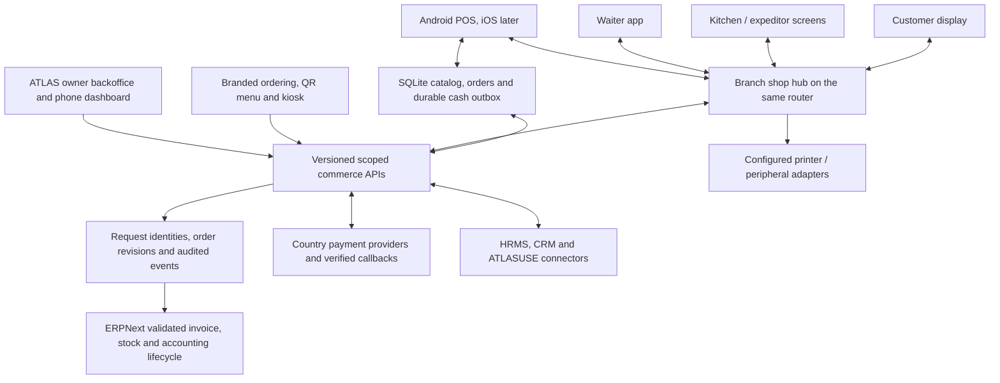

# ATLASERP commerce platform — Square capability benchmark

Prepared **2026-10-07** for the user's request to build a system with the breadth
of Square. This is a functional benchmark and an ATLAS delivery contract, using
our own ATLAS brand, design and code. It covers the linked POS product and its
connected business tools; a public feature page cannot establish exact parity
with every internal behavior, paid plan, country or future Square release.

The first customer experience remains **Moroccan retail and restaurants**, both
counter/takeaway and table service. Android tablet POS comes first, iOS follows.
**Offline cash and shared-router restaurant devices are required pilot gates.**
No printer model, payment processor or router host is assumed.

## What exists today

ATLASERP 0.4.2 retains the ATLAS workspace/theme, company/brand/branch/team metadata,
Street Pizza's 63-item demo menu, native ERP checkout, stock/accounting engine,
customer entry pages and installed HRMS/CRM applications. Menu preview is
read-only. Native ERP features are reusable building blocks: their availability
does not mean the corresponding ATLAS tablet, offline or restaurant workflow is
complete. Generic ERP API permissions still need an operational scope audit.

The first implementation against this benchmark is **0.4.2 register readiness**
([cashier guide and verification](POS_READINESS.md)):
`/atlas-pos` checks the authenticated operator's accessible registers, cashier
assignment, invoice/opening permissions, warehouse, price list, payment mapping,
cash change and existing sessions. It links to setup for authorized managers and
hands the selected company/profile to native online checkout. It does not open
or cancel a session by itself. Full register provisioning, financial transaction
idempotency, native endpoint scope enforcement and the Android app remain pending.

## Reference coverage

Reviewed official product pages on 2026-10-07. The short benchmark labels below
summarize advertised capabilities; the acceptance criteria are our proposed
ATLAS requirements, not claims about Square internals or compatibility.

| Reference | Advertised capability groups used here |
| --- | --- |
| [Square POS](https://squareup.com/us/en/point-of-sale) | Business modes, checkout, tenders, receipts, discounts, catalog, devices, staff, customer tools and connected products |
| [Restaurants](https://squareup.com/us/en/point-of-sale/restaurants) | Quick ordering, availability, floor plans/seats, courses, split checks, bar tabs, tableside service and live restaurant reports |
| [Retail](https://squareup.com/us/en/point-of-sale/retail) | Cross-channel stock, inventory history, bulk receiving, vendors/purchasing, labels, mobile stocktake, exchanges and catalog import |
| [Kitchen display](https://squareup.com/us/en/point-of-sale/restaurants/kitchen-display-system) | Shared tickets, preparation stations, expeditor, timers and preparation insights |
| [Reporting](https://squareup.com/us/en/point-of-sale/features/dashboard/analytics) | Sales comparisons, item/staff/location breakdowns, returning customers, CSV export and mobile dashboard |
| [Loyalty](https://squareup.com/us/en/software/loyalty) | Visit/spend/item/category rewards, enrollment/redemption, promotions, VIP tiers and digital loyalty passes |
| [Gift cards](https://squareup.com/us/en/gift-cards) | Physical/digital cards, QR/barcode redemption, reload, balance and refund-to-credit |
| [Shifts](https://squareup.com/us/en/staff/shifts) | Scheduling, attendance, labor costs, payroll preparation, time off, shift swaps and tips/commissions |
| [Advanced access](https://squareup.com/us/en/staff/advanced-access) | Custom action permissions, activity logs, passcodes and badge-assisted access |
| [Online ordering](https://squareup.com/us/en/online-ordering) | Ordering channel connected to restaurant operations |
| [Appointments](https://squareup.com/us/en/appointments) | Booking site, staff/resources/classes, calendar sync, reminders, waitlists, packages and no-show payment policies |
| [Invoices](https://squareup.com/us/en/invoices) | Customer billing alongside service-business workflows |
| [Banking](https://squareup.com/us/en/banking) | Financial products connected to merchant operations |
| [International development](https://developer.squareup.com/docs/international-development) | Country-specific payment support; Morocco is outside Square's listed processing regions |

Square card processing is therefore not the assumed Morocco payment backend.
ATLAS must integrate a provider approved for each seller country and validate its
actual terminal/API, refund, settlement and offline capabilities. Recording an
external card tender does not initiate or prove a card charge. Banking, credit,
financing and regulated wallets require partner services and a separate launch
decision; an ERP cash account is bookkeeping, not a bank account offered to users.

## Capability and gap register

Status: **Delivered** = specifically verified ATLAS behavior; **Engine** = native
ERP/HR/CRM building block requiring a guided ATLAS workflow and tests; **Build** =
custom work required; **Provider** = external integration/dependency.
Release numbers below express order, not dates. Linked existing ticket IDs stay
authoritative; avoid creating duplicate implementations for the same capability.

| ID | Capability / ATLAS acceptance target | Present base / gap | Release |
| --- | --- | --- | --- |
| SQ-01 | Guided legal company → brand → branch → register → cashier setup; re-opening setup preserves progress | Delivered business metadata; Build register provisioning | 1 |
| SQ-02 | Cashier register readiness, correct company, resume current-day session and explain busy/old shifts | Delivered 0.4.2 preflight; overnight policy and opening concurrency/guarding pending | 1 |
| SQ-03 | Touch favorites, categories, photos, barcode/search, quantity/UOM and accessible tablet cart | Engine catalog/native POS; Build Android experience | 2 |
| SQ-04 | Variants, sizes, bundles and required/optional modifiers with min/max choices and price deltas | Engine variants/prices; Build restaurant selection contract | 2 |
| SQ-05 | Hold, name, recall, edit and recover unpaid carts; committed orders retain revisions | Build durable cart/order store | 2–4 |
| SQ-06 | Server quotation, currency precision, tax-inclusive/exclusive prices, permitted discounts and rounding | Engine calculations; Build versioned quote/submit API | 2 |
| SQ-07 | Cash tender/change, split tenders, externally recorded card/transfer and auditable tender references | Engine tenders; Build guided payment and reconciliation | 2, 6 |
| SQ-08 | Double tap, timeout and replay return one invoice; failed attempts leave cart and no partial postings | Build request journal + unique identity + transaction boundary | 2 |
| SQ-09 | Brand/location receipts, print/reprint, digital receipt delivery opt-in, fiscal invoice reference | Engine printing; Build layouts, adapters and delivery | 2, 6 |
| SQ-10 | Full/partial returns, item/tax/discount reversal, manager approval, original-sale link and exchanges | Engine return invoices; Build guided authorization and tender reversal | 2, 5 |
| SQ-11 | Opening float, paid-in/out, closing count/variance, handover and visible consolidation failures | Engine sessions/closing; Build safe cash-management flow | 2 |
| SQ-12 | Offline cash survives process kill/reboot; sync queue explains pending/rejected sales without loss | Build SQLite journal/cache/outbox; offline policy required | 3 |
| SQ-13 | Admin configures supported printer/display/scanner/drawer roles; no hardcoded printer/address | Build enrollment, adapters, routing and compatibility evidence | 2–4 |
| SQ-14 | Revocable device identity, branch-scoped sync, remote settings/status and safe version rollout | Build device registry and signed configuration | 3–5 |
| SQ-15 | Counter, takeaway, pickup, dine-in and delivery orders share one settlement path | Build restaurant order model + fulfillment modes | 4 |
| SQ-16 | Floor plan/table/seat assignment, covers, table transfer/merge and waiter access | Build scoped table/order commands with revisions | 4 |
| SQ-17 | Send/hold/fire courses; station routing; later additions/cancellation reason remain traceable | Build kitchen event stream | 4 |
| SQ-18 | KDS preparation/ready/served queue, expeditor, timers, recall and measured prep time | Build kitchen app and durable acknowledgments | 4 |
| SQ-19 | Split bill by item, seat, equal share or selected amount; no double settlement or rounding drift | Build settlement allocation and payment orchestration | 4 |
| SQ-20 | Tabs, optional gratuity, tips, void/comp approvals and discount reasons | Build order/tip policies; preauthorization is Provider | 4, 6 |
| SQ-21 | Availability/sold-out counts and scheduled menus consistently reach POS, kiosk and online menu | Engine stock; Build availability projection and menu schedule | 4–6 |
| SQ-22 | Ingredient recipes, portion yields, preparation stock, wastage and food-cost analysis | Engine BOM/stock; Build restaurant recipe consumption rules | 5 |
| SQ-23 | Waiter → register → kitchen/customer screens/printers keep operating on the same router with WAN down | Build local hub, pairing, command journal and conflict recovery | 4 |
| SQ-24 | Stock by location, low-stock alerts, movements, batch/expiry/serial handling and traceable adjustments | Engine stock; Build simpler branch inventory UX | 5 |
| SQ-25 | Vendor directory, purchase order, partial receiving, supplier invoice and cost update | Engine purchasing; Build guided receiving and permissions | 5 |
| SQ-26 | Counts/stocktake by scanner/camera, transfers, discrepancy review and barcode labels | Engine counts/transfers; Build mobile count and label adapters | 5 |
| SQ-27 | Import/export with dry run, mapped columns, duplicate policy and row-level errors | Engine data import; Build merchant migration wizard | 5 |
| SQ-28 | Customer lookup, history, notes/preferences, consent, merge and scoped personal data | Engine Customer/CRM; Build unified POS customer view | 5 |
| SQ-29 | Loyalty earning/redeeming, visit/spend/item rules, tiers, promotions and refund reversal | Engine Loyalty Program; Build cross-channel reward journal | 5 |
| SQ-30 | Gift card/store credit issue, load, redeem, balance, refund and inter-branch liability tracking | Build separate liability ledger; no offline double-spend | 5–6 |
| SQ-31 | Manual/automatic promotions, time/quantity/category rules, coupon codes and limits | Engine Pricing Rule; Build unified policy with offline versions | 5 |
| SQ-32 | Opt-in email/SMS/WhatsApp campaigns, segments, unsubscribe, delivery status and attribution | Engine CRM + installed WhatsApp package; Provider + Build channels | 6 |
| SQ-33 | Public QR ordering, branded web shop, checkout, pickup slots, delivery zones and reordering | Delivered menu preview only; Build real orders and payments | 6 |
| SQ-34 | Self-service kiosk and customer display linked to the right register/order | Build purpose-specific UI/device roles | 4, 6 |
| SQ-35 | Delivery partner order ingestion, courier dispatch, status changes and cancellation reconciliation | Build connector framework; Provider per market | 6 |
| SQ-36 | Payment links, terminal/contactless, wallet/mobile-money, deposits, refunds and settlement matching | Engine external recording; Provider + Build adapters | 6 |
| SQ-37 | Card-on-file, preauthorized tabs, no-show charges and offline card acceptance | Provider capabilities; distinct from offline cash | 6–7 |
| SQ-38 | Scope/action permissions, manager overrides, cashier unlock, clock-in and actor audit | Delivered metadata scopes; Engine roles; Build POS-wide enforcement | 1–5 |
| SQ-39 | Staff rosters, breaks, overtime, shift swap, attendance and labor-vs-sales reporting | Engine installed HRMS; Build till integration/local rules | 5 |
| SQ-40 | Payroll, tips/commissions, expense approvals and accountant exports | Engine installed HRMS; Build/review Moroccan configuration | 5–7 |
| SQ-41 | Sales/refunds/tenders/taxes/cash variance/item/category/location/staff reports from reconciled records | Engine reports; Build common commerce metrics/dashboard | 5 |
| SQ-42 | Owner phone dashboard, comparisons, alerts, channel/customer metrics and CSV exports | Engine reports; Build owner app and aggregate APIs | 5–7 |
| SQ-43 | Appointments/classes, resource capacity, staff calendars, packages, reminders and waitlists | Build services vertical; calendar/messaging/payment integrations | 7 |
| SQ-44 | Estimates, customer invoices, recurring billing, deposits, milestones and contracts/signatures | Engine quotes/invoices/subscriptions; Build services UX/signatures | 7 |
| SQ-45 | Merchant support inbox, customer messages, review requests and reusable replies | Engine CRM/support; Build consent-scoped messaging integration | 6–7 |
| SQ-46 | Catalog photo tools and assistant for setup/report questions with confirmed consequential actions | Build optional AI/media tooling after reliable data/permission APIs | 7 |
| SQ-47 | Stable public APIs, authenticated webhooks, app integrations and ATLASUSE customer/lead handoff | Engine Frappe API; Build versioned commerce integration layer | 5–7 |
| SQ-48 | Cashflow view, bank reconciliation, provider payouts and optional financial partner offers | Engine accounting; Build integrations; banking/loans are Provider | 6–7 |
| SQ-49 | Morocco pack: MAD, French/Arabic, Casablanca time, business identifiers, tax/receipt/accountant exports | Engine currency/time/custom fields; Build reviewed country pack | 1–6 |
| SQ-50 | Merchant sites, subscriptions, safe upgrades, backups/restore, support diagnostics and exports | Delivered one evaluation VPS; Build managed merchant lifecycle | 1–7 |

No "all features complete" claim is allowed from this table. Coverage advances
only after the behavior and evidence in the corresponding ticket are delivered.

## Architecture for the complete system

Reuse Frappe authentication, native document validation and reports, Item,
Customer, Price List, Warehouse, Sales/POS Invoice, opening/closing, purchasing,
stock, Pricing Rule, Loyalty Program, HRMS and CRM. Extend them through the ATLAS
app; keep small engine changes documented/tested. Do not build a second financial
ledger in the mobile app or bypass ERP validation with direct SQL ledger writes.

New bounded models follow their tickets: Register/Device enrollment, durable
Sale Request, Restaurant Order/Order Revision, Table/Seat, Modifier Group,
Kitchen Ticket, Print Job, Gift Credit liability events and Sync Cursor.
Specify invariants and permissions before choosing fields or public endpoints.
Unpaid orders, quotes, local receipts, provider authorization and posted invoices
must remain distinct states with explicit links.

One independent merchant normally receives its own Frappe site/database. Brands,
branches and registers are operating scopes inside that merchant. Validate the
authenticated tenant/operator/company/branch/register on both ATLAS and native
endpoints. A short staff PIN unlocks an authorized device session; it must not be
an unrestricted server credential. Customers/kitchen screens only see their
assigned order/ticket projection.

Cash sale durability is atomic locally; requests are retryable and uniquely
identified at the server. All prices/tax/discount policies have versions. Conflicts
and rejections keep evidence visible. Device loss, WAN loss, hub loss and local
network loss have different recovery behavior. For full offline restaurant work,
the hub serializes order revisions and settlement; Wi-Fi connectivity alone does
not coordinate orders or authorize devices. See [MOBILE_POS.md](MOBILE_POS.md).

## Releases and measurable gates

| Release | Bounded outcome | Gate before moving on |
| --- | --- | --- |
| 1 — Ready register | Guided register setup, scopes, readiness, reviewed Morocco foundation and recovery baseline | Assigned cashier sees correct till; unavailable company/branch/register denied via UI and direct API; backup restores on staging |
| 2 — Android online cash | Touch catalog/cart, modifiers, server quote, one-time cash sale, configurable receipt, authorized returns and closing | On a named real device: open → sell → print → partial return → count/close; ERP ledger/stock/tenders agree; repeated requests do not duplicate |
| 3 — Offline cash | Approved catalog cache, bounded authorization, durable sale/outbox and reconciliation | WAN off + app kill + reboot + duplicate replay + timeout-after-commit produce no lost/duplicate sales; rejection remains reviewable |
| 4 — Connected restaurant | Shop hub, waiter/tables/seats/courses, kitchen, customer screen, split/transfer settlement and device routing | Two waiters and till cannot overwrite/pay the same order twice; shared-router service works without WAN and recovers after hub restart |
| 5 — Owner operations | Purchasing/counts/recipes, CRM/loyalty/promotions, staff permissions/attendance and reconciled reports | Location/item/tender totals agree with invoices and ledger; actual cashier cannot browse another scope or unrestricted ledgers |
| 6 — Omnichannel/payments | QR orders, shop/kiosk, delivery, digital receipts/messages and country provider payments | Duplicate/cancelled/late webhooks reconcile; unknown payment outcome remains unresolved until provider evidence; customer cannot see another order |
| 7 — Full platform | iOS, appointments/services, integrations, merchant lifecycle, advanced analytics/AI and optional financial partners | Real-device/store tests, vertical pilot, country-specific provider/accountant review, restore/upgrade rehearsal and support operations |

Commercial restaurant pilot requires releases 1–4, the applicable release 5
permissions/reporting gates, a reviewed country setup and recovery evidence.
Adding card processing or online ordering adds the corresponding release 6 gates.
Release 7 breadth is planned; it does not block a focused restaurant pilot.
No duration is promised before hardware and pilot throughput are measured.

## Small implementation tickets

Keep existing [POS_WORKFLOW.md](POS_WORKFLOW.md) and [MOBILE_POS.md](MOBILE_POS.md)
IDs, with these additions. Every ticket needs role/API cases, failed/retry paths,
translation/touch states where relevant and a concise record of evidence.

| Ticket | Small deliverable | Acceptance / dependencies |
| --- | --- | --- |
| MOB-01A | Read-only readiness page and verified native handoff | 0.4.2: assigned profiles, account errors, current/busy/conflicting/old shift states, scoped unsaved closing link, guest/website/scope denials; never submits financial documents |
| POS-01A | Explicit branch/register mapping and guided profile creation | Bind one profile to one branch/till; valid warehouse/price/account/cashiers; repeated setup does not duplicate |
| POS-01B | Scope native POS reads/search/profile APIs | Cashier cannot read arbitrary profiles/accounts/customer history; negative direct API cases |
| POS-01C | Scope opening/invoice/return/closing writes | Validate actual operator/company/branch/register for both native invoice modes; forged or disabled staff denied |
| POS-01D | Restaurant overnight shift/business-day policy | Specify local timezone/cutoff and maximum shift rules; align entry and invoice validation; test midnight, returns, reporting and closing without changing recorded sale dates |
| Q02 | Automated protected backups and restore rehearsal | Restore DB/files/config/keys on isolated site; recovery steps proven before commercial pilot |
| MA-01 | Reviewed Morocco shop/receipt examples | Obtain legal identifiers, accountant-approved tax cases and cash/return receipt examples; no inferred tax-rate defaults |
| MOB-02–03 | Pinned Android app, enrollment and protected credentials | Named device installs; revocation and French/Arabic layout; no embedded admin key |
| MOB-04 | Scoped catalog bootstrap with policy version | Prices/variants/modifiers/scanner data load for assigned register; disabled/stale definitions visible |
| MOB-05 | Safe open/resume command | Concurrent/repeated opening returns one session; own shift resumes; another operator requires authorized handover |
| MOB-06A | Touch catalog/search/favorites | Cashier finds/scan-selects item with predictable focus; long labels and touch targets tested |
| MOB-06B | Durable cart and modifier editor | Min/max selections enforced; quantities/prices preserved across restart; unpaid state explicit |
| MOB-07A | Server quote contract | Decimal totals/taxes/rounding and discount authority checked; client cannot invent price/tax |
| MOB-07B | Transactional sale request journal | Request identity bound to scope/payload; duplicate returns original result; changed-payload replay rejected |
| MOB-07C | Cash tender/change and posting adapter | Reviewed 100 MAD tender / 50 MAD sale / 50 MAD change example balances using native invoice lifecycle |
| MOB-08A | Receipt document schema/layouts | Company/branch/item/modifier/tax/tender/change fields; clear local vs final invoice reference |
| MOB-08B | Configurable network printing | Supported connection/protocol, role routing and test action; unknown delivery/reprint never reposts sale |
| MOB-09A | Original-sale partial/full return | Permission, quantity/tender limit, negative tax/discount and stock effects reconcile |
| MOB-09B | Cash movements and count/closing | Float + cash sales − cash refunds + paid-in − paid-out = expected; approved variance; queued consolidation visible |
| MOB-10A | SQLite sale/outbox atomic transaction | Kill between writes cannot create receipt without recoverable sale event |
| MOB-10B | Retry/dedup sync and rejected-sale recovery | Timeout after commit and repeated replay give one invoice; rejection evidence retained |
| MOB-10C | Offline policy/version expiry | Stale taxes/prices, authorization, stock and closed periods have explicit accepted/review/block policies |
| MOB-11 | Actual Android/peripheral lifecycle pilot | Battery/background/reboot/app update/storage recovery and printer characters tested |
| LAN-01–07 | Hub runtime, pairing, shared state, routing and recovery | Follow existing network ticket detail; independent WAN/LAN/hub failure cases |
| REST-01A | Restaurant order/table/seat model | Unpaid orders don't post invoices; scope/revisions/conflicts explicit |
| REST-01B | Waiter floor plan, merge and transfer | Concurrent moves cannot overwrite an occupied/paid order |
| REST-02A | Kitchen send/stations/course commands | Repeat send yields one ticket; later items and cancellations preserve trace |
| REST-02B | KDS and expeditor | Ack/preparing/ready/served; reconnect restores tickets; timers measured from events |
| REST-03A | Single settlement adapter | Retry returns same invoice; failure preserves unpaid order |
| REST-03B | Split settlement allocation | Item/seat/equal/amount splits conserve total incl rounding; concurrent settlement rejected |
| REST-04 | Availability and timed menu | Sold-out/scheduled changes propagate to allowed channels; offline policy defined |
| INV-01 | Purchase/receive wizard | Partial receive, duplicate barcode and supplier cost changes handled |
| INV-02 | Counts/transfers/labels | Reviewed variances and location reconciliation; label adapter tested |
| INV-03 | Recipes/yield/waste | Sale consumes reviewed ingredients once; returns/waste policies explicit |
| CX-01 | POS customer history and consent | Scope, merge and required data validated; no public customer enumeration |
| CX-02 | Loyalty ledger, rules and reversal | Repeated sale/reversal never awards or consumes points twice |
| CX-03 | Gift credit ledger | Loads/redemptions/refunds balance liability; concurrent spending rejected; offline limits explicit |
| CX-04 | Promotion designer | Rule priority, coupon limits and offline policy version yield reviewed totals |
| TEAM-01 | PIN unlock, manager override and till clock-in | Device auth separate from PIN; reason/actor logged; HRMS mapping reviewed |
| TEAM-02 | Scheduling and labor reports | Attendance/break/cost examples tie to employee records and posted sales |
| REPORT-01 | Common reporting measures | Define sale business-day/timezone, tax/gross/net/tip/refund/settlement separately; cross-check both invoice modes without consolidation double count |
| REPORT-02 | Owner dashboard/export | Role-scoped branch/period filters; fresh vs pending offline totals clearly labeled |
| CHANNEL-01 | QR/web order and pickup/delivery | Order accepted once; inventory/availability/slots checked; authenticated order access |
| CHANNEL-02 | Kiosk and customer display | Paired till/order, constrained UI, privacy and disconnection states |
| CHANNEL-03 | Partner fulfillment connectors | Documented API/auth; retries/cancellation/status reconciliation |
| PAY-01 | Morocco provider capability assessment | Verify acquiring contract, SDK/terminal, callbacks, refunds/settlement/currencies; select based on evidence |
| PAY-02 | Provider payment attempt state machine | Created → pending/authorized/captured/failed/unknown → reconciled; authenticated/deduplicated callbacks |
| PAY-03 | Refunds, settlement and advanced tenders | Provider reference matches tender/invoice/payout; preauth/offline/wallet only when supported |
| MSG-01 | Opt-in receipt/order messages and campaigns | Provider setup, consent/unsubscribe, delivery evidence; no messages sent by tests |
| SERVICE-01 | Staff/resource booking and waitlist | No overlap/double capacity; timezones, cancellation and reminders tested |
| SERVICE-02 | Service estimates/contracts/billing | Quotes → approvals → deposit/milestone invoice; signature provider evidence |
| IOS-01 | iOS device adapters and release | iPad/iPhone device/print/restart/sync tests and signing/store process |
| PLATFORM-01 | Merchant onboarding/upgrade/support lifecycle | Tenant boundary, provisioning, plan limits, migration rehearsal and per-merchant recovery |
| PLATFORM-02 | ATLASUSE/third-party API connectors | Scoped authorization, durable sync, field ownership/conflict policy and versioned webhooks |
| PLATFORM-03 | Assistant/media and finance partners | Permission-filtered verified results; explicit transactional actions; partner scope verified independently |

## Immediate next work

MOB-01A is delivered and verified. Continue with **POS-01A–C and MOB-02–04**.
Register/device scopes must be established before sale/offline APIs can be trusted. Continue the online
sale and closing path, then offline recovery, then the multi-device restaurant
flow. HR/CRM installation remains available; it is not the priority dependency
for a working restaurant till.

Record at each release: source/image versions, staging cases, device models and
interfaces actually tested, representative transaction reconciliation, known
limits and rollback/recovery evidence. Declare a capability delivered only when
the actual business workflow passes, not when its menu entry appears.
