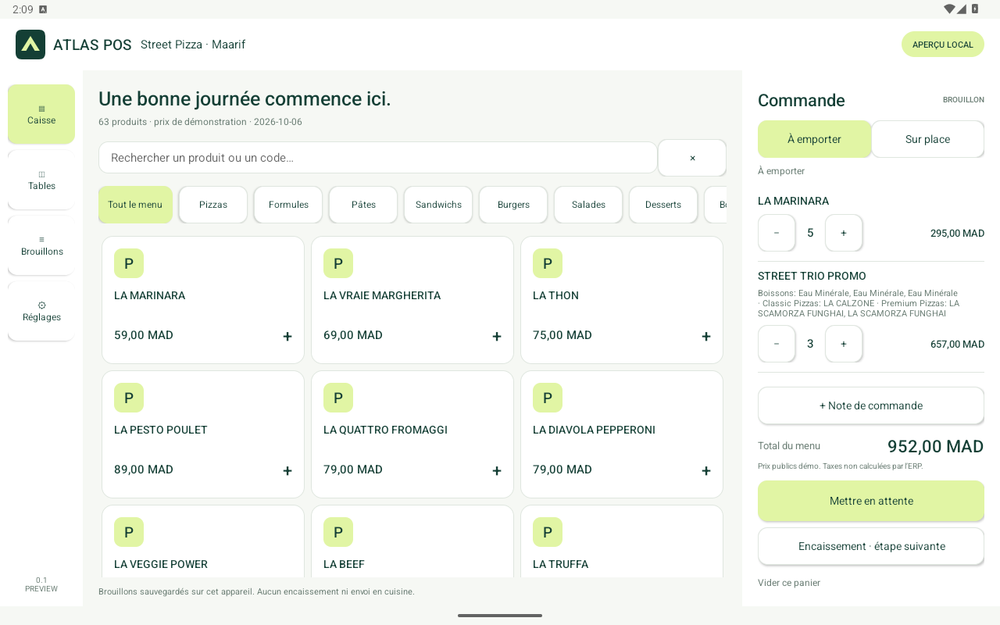

# ATLAS POS — Android preview 0.1

Native Android tablet foundation in ATLAS green/lime. This is a **local draft
preview**, not a cashier-ready POS release. The deployed ERP web checkout remains
ATLASERP 0.5.0. The benchmark and delivery sequence are in
[MACAISSE_BENCHMARK.md](../../docs/atlas/MACAISSE_BENCHMARK.md).

## Try the interface

[Download Android preview 0.1](https://erp.atlasuse.site/downloads/atlas-pos-preview-0.1.0.apk).


Install the debug APK on a development Android tablet with Android 8.0 or later.
Open **ATLAS POS Preview**. Tap a product, complete required choices, change
quantities and enter a note. Choose takeaway or a demo table. “Mettre en attente”
saves the draft; **Brouillons → Reprendre** resumes it. Close/reopen the app to
verify recovery. Settings supports French or Arabic interface direction.

The catalog contains 63 Street Pizza public menu entries, captured 2026-10-06.
Build assets read the repository's canonical JSON directly. Prices are a frozen
demo snapshot, not a register price/tax quote. Menu names remain in the source
language. The 12-table screen is a demo draft selector, not shared availability.

No sign-in, invoice posting, payment processing, receipt printing, LAN device
discovery or shared kitchen state exists in this build. The payment action
explains the next connection step. The app has **no network permission**. Web
links launch the device's browser, where normal ERP login still applies.

## Build

Pinned: Android Gradle Plugin 8.7.3, Gradle 8.9, Java source 17, compile/target API
35, minimum API 26. Use JDK 17 or a compatible newer JDK (verified with the
Android Studio bundled JBR 21). Install Android SDK platform 35 and build tools.
Set `ANDROID_HOME` or local `local.properties` containing `sdk.dir`.

```sh
cd mobile/atlas_pos
./gradlew testDebugUnitTest lintDebug assembleDebug assembleDebugAndroidTest
```

Debug APK: `app/build/outputs/apk/debug/app-debug.apk`.
Install test APK after the preview APK on a **dedicated development emulator**:

```sh
adb install -r app/build/outputs/apk/debug/app-debug.apk
adb install -r app/build/outputs/apk/androidTest/debug/app-debug-androidTest.apk
adb shell am instrument -w com.atlasuse.pos.preview.test/com.atlasuse.pos.PreviewInstrumentation
```

The UI smoke test adds a draft item in the preview app. Storage recovery tests
use a separate test database in the preview package. Do not run the test on a
device holding drafts you need to preserve. Financial records are never created by the test.

The package `com.atlasuse.pos.preview` is deliberately separate from a future
enrolled production package. Debug signing is for development. Store distribution,
release signing/updates and hardware qualification remain MOB-11 work.

## Architecture and recovery

- `Cart.java`: pure Java model, integer MAD minor units, quantities and required
  meal choices. No tax/ledger implementation.
- `Catalog.java`: validates the canonical menu and computes a SHA-256 identity.
- `DraftStore.java`: SQLite transaction stores active cart, held carts, service
  mode, table, notes and language together. Corrupt/version-mismatched data fails
  closed without clearing the database or silently repricing it.
- `MainActivity.java`: Android Views UI, adaptive tablet/compact screens and RTL.

The initial Android-only decision supersedes the earlier Flutter recommendation:
use native Android APIs now, keeping domain and storage separate from views and
future hardware/network adapters. An iOS implementation is outside this delivery.
Database migration, export/restore and durable **sale** outbox will be explicit
future changes. Local previews contain public menu data and drafts only; no
cashier tokens, customer details or payment credentials are collected.

## Verification record

Verified 2026-10-08:

- `testDebugUnitTest`: six tests, no failures; exact minor units, modifier validation,
  equivalent selections, copy independence, quantity limits and accented search.
- Dedicated `Atlas_Tablet` x86_64 emulator, Android API 36, 1280 × 800 at 160 dpi:
  APK installation, 63 items/9 categories, SQLite close/reopen recovery, notes,
  table and language persistence, touch add/search, incomplete-meal rejection,
  completed-meal total and Arabic RTL checks passed.
- The same emulator at 480 × 900: the compact menu/navigation and choice/RTL checks
  passed. Screens were inspected; menu and table rows keep equal cell widths.
- Cold process relaunch recovered the active cart. These are local preview drafts;
  no ERP opening, invoice, ledger or kitchen command was created.
- `lintDebug`: zero errors. The report contains `OldTargetApi` and
  `DataExtractionRules` warnings. Target/platform policy and backup/transfer
  behavior must be reviewed on qualified devices before release distribution;
  this preview declares backup disabled and explicit extraction exclusions.
- Final APK signature verifies. The packaged menu asset matches the canonical
  repository JSON byte for byte; the APK declares no permissions.
- Public HTTPS download succeeds and is byte-identical to the final local APK.
  Published into the site's persistent `public/downloads` volume, file owner
  `frappe:frappe`, mode `0644`; no container restart or ERP migration was required.

Final APK SHA-256:

```text
b67fc51ee9fb7cec060be3932058fa527d54d15c9de8ba38d73d348a4d4216c9
```



[Arabic tablet](../../docs/atlas/images/android-pos/tablet-ar.png) ·
[Compact French](../../docs/atlas/images/android-pos/compact-fr.png) ·
[Compact Arabic](../../docs/atlas/images/android-pos/compact-ar.png)

MOB-02's development app/toolchain gate is satisfied on this named emulator.
MOB-06's demo menu/cart/draft subset is delivered; scoped live prices, scanner
handling and physical device qualification remain open. Next: MOB-03 device and
cashier authorization, MOB-04 scoped bootstrap and MOB-05 safe session handling,
then MOB-07 transactions. Mandatory offline cash and shared restaurant/device
operation retain their separate gates; this build does not claim either.
